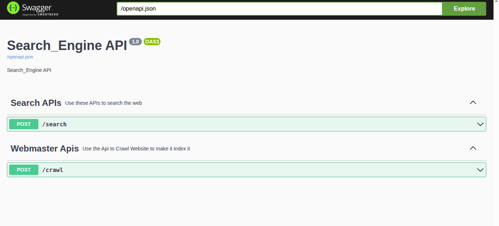
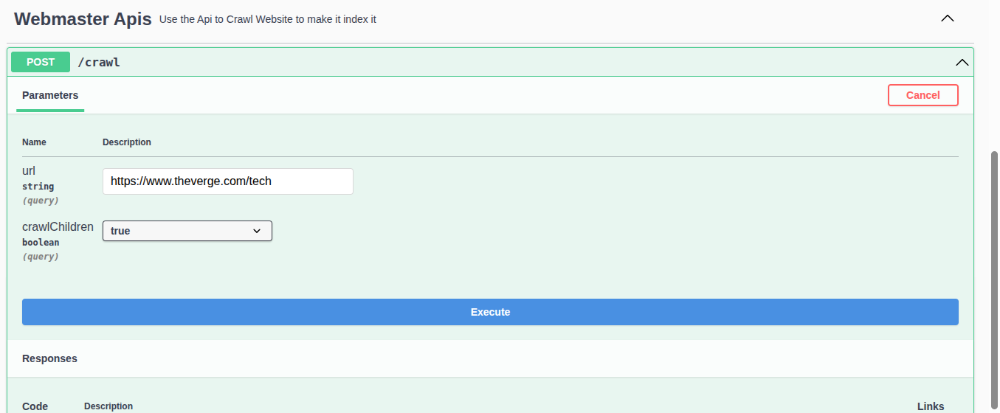
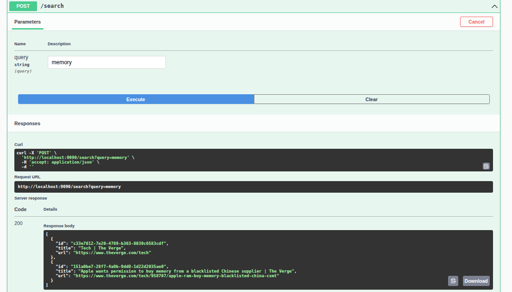

# 🔍 Search Engine

A lightweight web search engine built with **Java** and **Dropwizard**. It crawls websites, builds an inverted index using NLP (Stanford CoreNLP), and lets you search through the indexed content via a REST API + Web UI.





## 🚀 Features

- **Web Crawler** — Crawl websites and extract page content using HtmlUnit
- **NLP Powered Indexer** — Tokenizes & lemmatizes content using Stanford CoreNLP for better search results
- **Inverted Index** — Fast in-memory search using inverted indexing
- **REST APIs** — Simple endpoints to crawl and search
- **Swagger UI** — API documentation at `/swagger`
- **Web Interface** — Clean browser UI to search right away

## 🛠️ Tech Stack

| Technology | Purpose |
|---|---|
| **Dropwizard** | Web framework |
| **Stanford CoreNLP** | NLP (tokenization, lemmatization) |
| **HtmlUnit** | Web crawling |
| **Guice** | Dependency injection |
| **Swagger** | API docs |
| **Lombok** | Boilerplate reduction |

## ⚙️ Configuration

Edit `config/local.yml` to configure:

```yaml
server:
  applicationConnectors:
    - type: http
      port: 9090

CrawlingConfig:
  maxDepth: 1        # Max crawl depth
```

> 💡 The app runs on **port 9090** by default (configurable in `local.yml`).

## 🏃 Running the App

```bash
# Build the project
mvn clean package

# Run the server
java -jar target/search-engine-1.0-SNAPSHOT.jar server config/local.yml
```

## 📡 API Endpoints

### 1️⃣ Crawl a Website
```bash
POST /crawl?url=https://example.com&crawlChildren=false
```

### 2️⃣ Search
```bash
POST /search?query=your+search+term
```

### 3️⃣ Swagger Docs
Open `http://localhost:9090/swagger` in your browser.

## 🙌 Acknowledgements

Built with help from online resources and documentation for understanding **Dropwizard**, **Stanford CoreNLP**, and **inverted indexing** concepts.